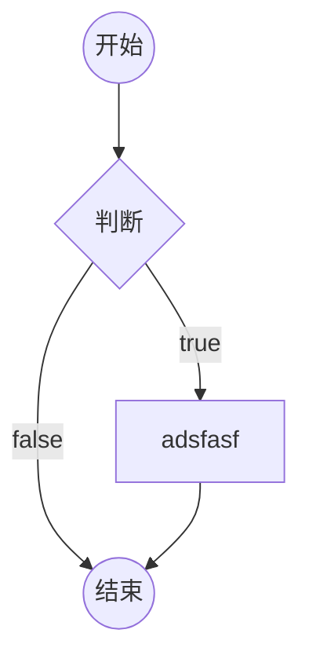
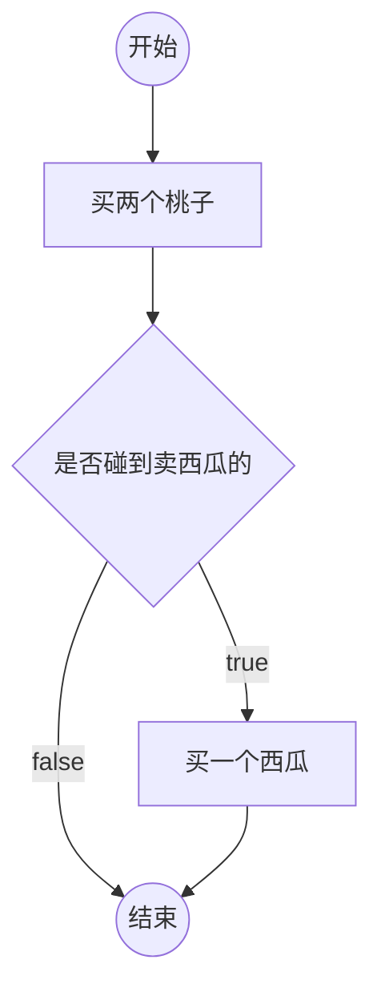
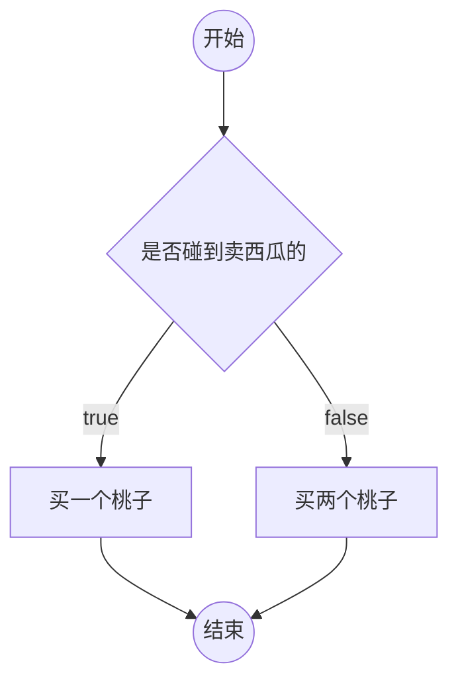

# 流程图

一套的标准的图形，用于描述程序的逻辑

通常流程图分析程序的流程

> markdown中粘贴图片，ctrl + alt + v

## 在 markdown 中画流程图

```mermaid
graph TD
start((开始))-->if{判断}
if--true-->A[adsfasf]
if--false-->ed((结束))
A-->ed
```

## 例子

邓哥的思维：

```mermaid
graph TD
st((开始)) --> buyPeach[买两个桃子]
buyPeach-->if{是否碰到卖西瓜的}
if--true-->buyXigua[买一个西瓜]
if--false-->ed((结束))
buyXigua-->ed
```

成哥的思维：

```mermaid
graph TD
st((开始)) --> if{是否碰到卖西瓜的}
if--true-->买一个桃子
if--false-->买两个桃子
买一个桃子-->ed((结束))
买两个桃子-->ed
```